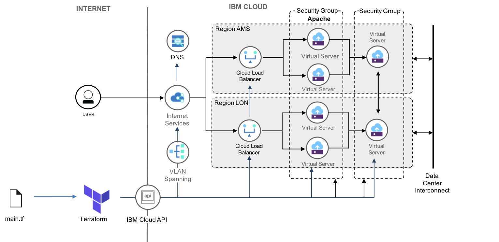

# Sample Terraform multi-region web site deployment for IBM Cloud IaaS

steve_strutt@uk.ibm.com
Licensed under the Apache License, Version 2.0 (the "License");

Demo Terraform configuration to deploy the IBM Cloud IaaS infrastructure for a secure and scalable Wordpress implementation, based on 
 - 1 x IBM Cloud Internet Services 
 - 2 x IBM Cloud Load Balancer
 - 6 x Virtual Machines
 - 3 x Security Groups
 - 4 x httpd app server
 - 2 x mariadb
 - Vlan spanning 

This is written as a capability demonstration for the automated deployment of high availability web sites utilising IBM Cloud Internet Services (CIS). A demo website using Wordpress can be installed using the example in `terraform-provider-ibm/examples/ibm-ansible-samples/` A tutorial covering installation of Terraform, execution of this configuration and deployment of Wordpress on this infrastructure can be found in the tutorials section of [Automating cloud resource provisioning with Terraform](https://cloud.ibm.com/docs/terraform/index.html#index) on IBM Cloud Docs.  


<p style="text-align: center;">
  
</p>

## Costs

This sample uses chargable services and **will** incur costs. Billing for the CIS service instance is pro-rata'd for the remaining duration of the month it is deployed in. Execution of `terraform destroy` will result in deletion of all resources including the CIS service instance. Billing for VSIs and Cloud Load Balancing will terminate on the hour. The billing for the CIS service instance will be pro-rata'd to the end of the month. For each delete and recreate of the environment a new CIS service instance will be created and result in an additional billing instance pro-rata'd for the month. 

To avoid additional CIS service instance costs if the sample confifuration is executed additional times, after creation the `ibm_cis` resource should be removed from the configuration and replaced with a `ibm_cis` data source. All dependent CIS Terraform resource definitions must also be updated to reference the `data source`. A replacement data-source sample configuration is included in the `dns.tf` file. 

The following steps can be used to replace the `ibm_cis` resource with a data source to preserve the CIS service instance.


  1. Create the initial environment

    ```shell
    terraform apply
    ```

  2. Delete the ibm_cis resource from the Terraform state.

    ```shell
    terraform state rm ibm_cis.wordpress_domain
    ```

  3. Update `dns.tf` to replace the `ibm_cis` resource with a data source. 
     - Comment out lines 17 - 89
     - Uncomment lines 93 - 163
     - Save file

  4. Refresh the Terraform state file with the new data source.

    ```shell
    terraform plan
    ```
  5. Delete the existing web site deployment

    ```shell
    terraform destroy
    ```

## DNS 

The assigned public DNS name for the website Internet Services global load balancer will be output at the end of the `terraform apply` command. 

```
Apply complete! Resources: 45 added, 0 changed, 0 destroyed.
Outputs:
web_dns_name = http://wcpclouduk.com
```


The address <web_dsn_name> can be used to validate that a basic Apache web server is accessible via the Internet Services global load balancer. Note it can take minutes to hours for the DNS changes to propagate to your DNS name servers and for the website to be accessible. 

Run curl with <adddress> to return the Apache splash page, or use a web browser to display the page. 
`curl <address> -vS` 

```
<!DOCTYPE html PUBLIC "-//W3C//DTD XHTML 1.1//EN" "http://www.w3.org/TR/xhtml11/DTD/xhtml11.dtd"><html><head>
<meta http-equiv="content-type" content="text/html; charset=UTF-8">
        <title>Apache HTTP Server Test Page powered by CentOS</title>
        <meta http-equiv="Content-Type" content="text/html; charset=UTF-8">

```


## Dependencies

- User has IaaS security rights to create VMs, Security Groups and Loadbalancer
- User has IAM security rights to create and configure an Internet Services instance
- User VPN to the IaaS platform has been configured.
- SSL key for remote user access to VMs
- DNS Domain registration

There is no dependancy on existing networking configuration, firewalls or SSL/TLS certificates. A DNS domain registered on IBM Cloud is required at an approximate cost of $10 a year.  


## Configuration 

The following variables need to be set in the `terraform.tf` file before use

* `softlayer_username` is an Infrastructure user name. Go to https://control.bluemix.net/account/user/profile, scroll down, and check API Username.
* `softlayer_api_key` is an Infrastructure API Key. Go to https://control.bluemix.net/account/user/profile, scroll down, and check Authentication Key.
* `bluemix_api_key` - An API key for IBM Cloud services. If you don't have one already, go to https://console.bluemix.net/iam/#/apikeys and create a new key.


Customise the variables in `variables.tf` to your local environment and chosen DNS domain name. 

* `domain` in the DNS Domain for web server registed with the DNS registrar. The DNS domain must be pre-registered with the IBM Cloud [Domain Registration Service](https://cloud.ibm.com/classic/services/domains). 
* `dns_name`. DNS name (prefix) for website, including '.',e.g. 'www.' Can be "" for website to be at root of domain. 
* `datacenter1`. Name of data center for region 1. 
* `datacenter2`. Name of data center for region 2. 
* `resource_group`. Name of the Resource Group configured resources will be allocated to. Default is "Default". 
* `ssh_label`. Name for ssh key used for VSIs
* `ssh_key`. ssh public key for VSIs
  

## Running the configuration 

```shell
terraform init
terraform plan
```

For apply phase

```shell
terraform apply
```

For destroy see notes under **Costs** for how to preserve the CIS service instance to avoid additional billing costs for further instances. Otherwise destroy all resources. 

```shell
terraform destroy
```  
