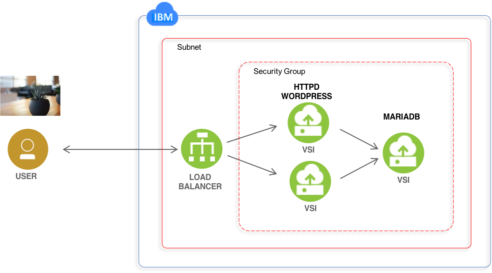

# IBM single data center website with IaaS 

steve_strutt@uk.ibm.com
Licensed under the Apache License, Version 2.0 (the "License");

Demo Terraform configuration to deploy the IBM Cloud IaaS infrastructure for a simple Wordpress implementation, based on 
 - IBM Cloud Load Balancer
 - Virtual Machines
 - Security Groups
 - httpd app server
 - mariadb 

This is written as a capability demonstration of deploying web sites using Terraform on IBM Cloud IaaS. The tutorial xxxxxx provides full instructions on how to deploy this example.  

<p style="text-align: center;">
  
</p>

## Costs

This sample uses hourly chargable services. Deploying this sample will cost in the region of a few cents per hour. Destroying the configuration, will result in no further costs being incurred. 

A registered DNS domain name and SSL/TLS certificate are not required. 


## DNS propagation

DNS name updates for the load-balancer can take anywhere from 10 to 30 minutes to propagate to global nameservers after this configuration is applied. 

The assigned public DNS name for the load balancer will be output at the end of the terraform apply command. Illustrated here:

```
Apply complete! Resources: 17 added, 0 changed, 0 destroyed.
Outputs:
web_dns_name = http://web-lb-1530547-lon06.lb.bluemix.net


Run curl with <web_dsn_name> to return Apache splash page. Note this will fail until the DNS name has been propagated to your local DNS name server. 

`curl <address> -vS` 

```
<!DOCTYPE html PUBLIC "-//W3C//DTD XHTML 1.1//EN" "http://www.w3.org/TR/xhtml11/DTD/xhtml11.dtd"><html><head>
<meta http-equiv="content-type" content="text/html; charset=UTF-8">
        <title>Apache HTTP Server Test Page powered by CentOS</title>
        <meta http-equiv="Content-Type" content="text/html; charset=UTF-8">

```


## Dependencies

- User has IaaS security rights to create VMs, Security Groups and Loadbalancer 
- User VPN to the IaaS platform has been configured.
- SSL key for remote user access to VMs

There is no dependancy on an IaaS existing networking configuration or firewalls, domain names or SSL/TLS certificates. A DNS domain name is dynamically allocated by IBM Cloud to the Cloud Load Balancer. No user registered domain name is required. 


## Configuration 

The following variables need to be set in the terraform.tf file before use

- softlayer_username is a Infrastructure user name. Go to https://control.bluemix.net/account/user/profile, scroll down, and check API Username.
- softlayer_api_key is a Infrastructure API Key. Go to https://control.bluemix.net/account/user/profile, scroll down, and check Authentication Key.
- bluemix_api_key - An API key for IBM Cloud services. If you don't have one already, go to https://console.bluemix.net/iam/#/apikeys and create a new key.


## Running the example

For planning phase

```shell
terraform plan
```

For apply phase

```shell
terraform apply
```

For destroy

```shell
terraform destroy
```